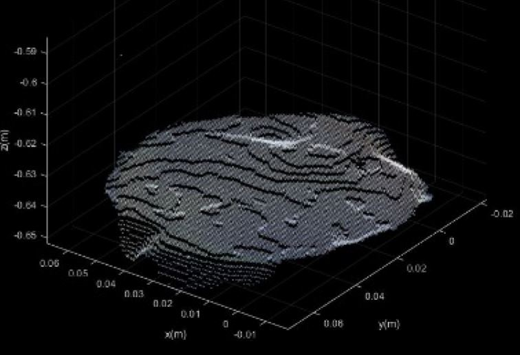
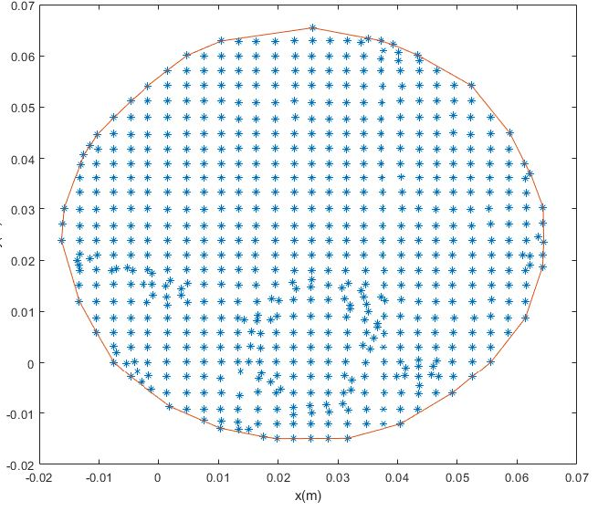

# RGB-D-volume-measurement
Measure the volume of not transparent liquids that are in a container with the pointclouds obtained with an RGB-D camera

To measure the volume effectively with this method, first it’s needed to obtain the point cloud of the inferior (ground surface) and the superior plane (top surface of the liquid). Also, these pointclouds must be in planes were the points that are in it have the same z coordinates. Therefore, it’s possible that an alignment with a plane estimator (MSAC) and a rotation in the space is needed firstly.

                      
                      
## Area
To calculate the area of the top plane pointcloud, first the convex hull of this surface is obtained, then with the points that form the convex hull the Gauss area formula is applied to obtain the area.

                      
                      
## Height

To obtain the height of the liquid that is in the container first a robust method to delete outliers is applied, then with the difference of the medians of the inferior and superior z coordinates the height is obtained.
#

The volume is the product between area and height.

This algorithm was part of a research project where various not transparent liquids at different situations were tested. The error between the real volume and the obtained one was bellow 10% in all cases.
